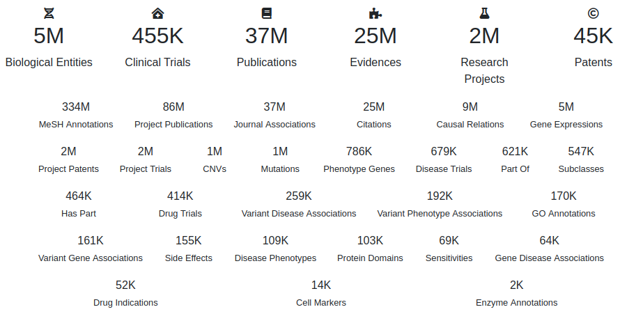

INDRA CoGEx
===========
[](https://github.com/bgyori/indra_cogex/actions/workflows/tests.yml)
[](https://github.com/psf/black)

INDRA CoGEx (Context Graph Extension) is an automatically assembled
biomedical knowledge graph which integrates causal mechanisms from INDRA with
non-causal contextual relations including properties, ontology, and data.

## Content



| Knowledge source                                                    | Relation                            | Description                                                                                                                    |
|---------------------------------------------------------------------|-------------------------------------|--------------------------------------------------------------------------------------------------------------------------------|
| [INDRA](indra.bio)                                                  | indra_rel                           | The source regulates or interacts with the target according to an INDRA Statement.                                             |
| [INDRA Ontology](indra.bio)                                         | isa / partof                        | The source node is a subclass or part of the target node.                                                                      |
| [Gene Ontology](http://geneontology.org/)                           | associated_with                     | The gene represented by the source is associated with the GO term represented by the target.                                   |
| [BGee](https://bgee.org/)                                           | expressed_in                        | The gene represented by the source is expressed in the tissue/cell type represented by the target.                             |
| [CCLE](https://www.cbioportal.org/study/summary?id=ccle_broad_2019) | mutated_in / copy_number_altered_in | The gene represented by the source is mutated or its copy number is altered in the cancer cell line represented by the target. |
| [CCLE](https://www.cbioportal.org/study/summary?id=ccle_broad_2019) | sensitive_to                        | The cancer cell line represented by the source is sensitive to the drug represented by the target.                             |
| [ClinicalTrials.gov](https://clinicaltrials.gov/)                   | tested_in                           | The drug represented by the source is tested in the clinical trial represented by the target.                                  |
| [ClinicalTrials.gov](https://clinicaltrials.gov/)                   | has_trial                           | The disease/condition represented by the source has a clinical trial represented by the target.                                |
| [ChEMBL](https://www.ebi.ac.uk/chembl/)                             | has_indication                      | The chemical represented by the source has been studied for use against the indication represented by the target.              |
| [SIDER](http://sideeffects.embl.de/)                                | has_side_effect                     | The chemical represented by the source has a side effect represented by the target.                                            |
| [Reactome](https://reactome.org/)                                   | haspart                             | The pathway represented by the source node contains the gene represented by the target node.                                   |
| [WikiPathways](https://www.wikipathways.org/)                       | haspart                             | The pathway represented by the source node contains the gene represented by the target node.                                   |
| [Enzyme Codes](https://www.ebi.ac.uk/intenz/)                       | has_activity                        | The relation between a gene and its enzyme class(es).                                                                          |

## Installation

Install the `indra_cogex` package with:

```shell
$ git clone https://github.com/bgyori/indra_cogex
$ cd indra_cogex
$ pip install -e .
```

## Build

Build the graph then bulk import into Neo4j with:

```shell
$ python -m indra_cogex.sources
$ sh import.sh
```

## Funding
The development of this project is funded under the DARPA Young Faculty Award
(ARO grant W911NF2010255).
